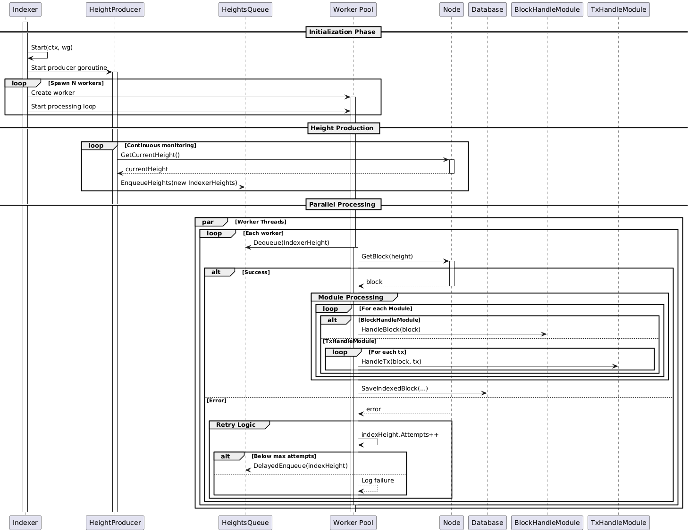

# Indexing overview

Here is explained how we fetch and process blocks from a generic block chain.

## Architecture

The indexing logic is implemented by the `Indexer` struct, which uses a `Node` to
determine the current blockchain height and fetch the blocks that have not yet been indexed.
To identify which blocks are unindexed, the `Database` provides information on the indexed blocks
and allows marking a block as indexed.  
Below is a UML diagram that shows the relationships between each component.


## Block  processing 

This system monitors blockchain blocks, indexes missing data, and handles processing errors with retry logic.  
The architecture combines parallel processing with modular data handling.



### Key Components  

- **Monitor** (`observeProducedBlocksLoop`): Continuously checks blockchain height  
- **HeightsQueue**: Stores block heights needing processing  
- **Workers** (`indexingLoop`): Parallel processes that handle actual indexing  
- **Processing Modules**: Specialized handlers for blocks or transactions  

### Workflow Stages  

#### 1. Block Monitoring & Detection  

```
Indexer → Monitor → Node → HeightsQueue  
```
- Checks current blockchain height at regular intervals  
- Identifies gaps between last indexed block and current chain height  
- Enqueues missing block heights for processing  

#### 2. Parallel Block Processing  

```
Workers ← HeightsQueue → [Node → Modules → Database]  
```
- Multiple workers simultaneously:  
  1. Fetch block data from node  
  2. Process through BlockHandleModule (entire block)  
  3. Process each transaction through TxHandleModule  
  4. Mark block as indexed in the database  

#### 3. Error Recovery System  

**Failure handling follows configurable retry policies**:  
1. **Retry Mechanism**:  
   - On block processing failure, increments attempt counter  
   - Re-enqueues with delay using `DelayedEnqueue()` if under max attempts  

2. **Configurable Parameters**:  
   - **Max Attempts**: User-defined retry limit (default 5)  
   - **Re-enqueue Delay**: Adjustable delay between heights re-enqueue for retry (default 10 seconds) 

3. **Termination**:  
   - Logs "Max attempts reached" when threshold exceeded  
   - Permanently abandons problematic block after final attempt  

